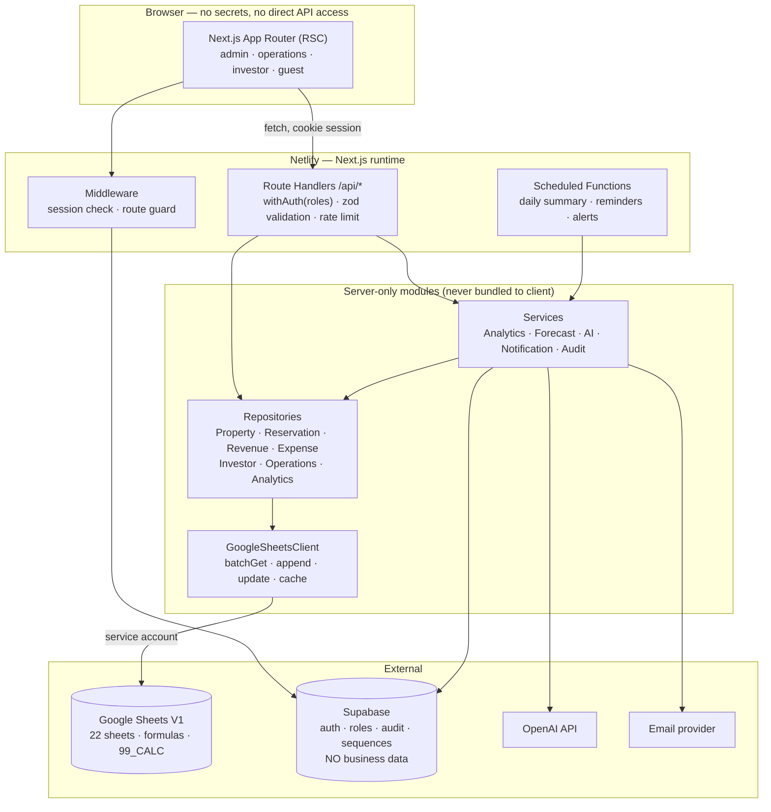
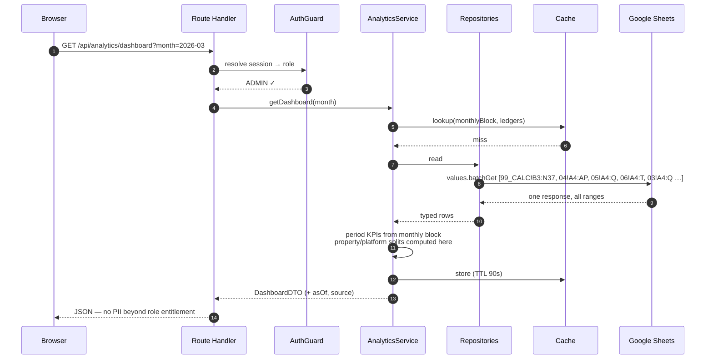
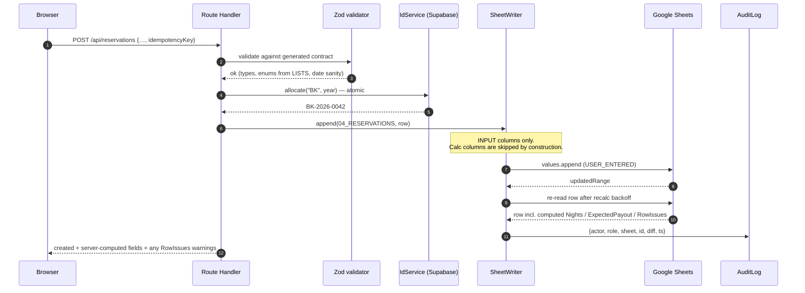
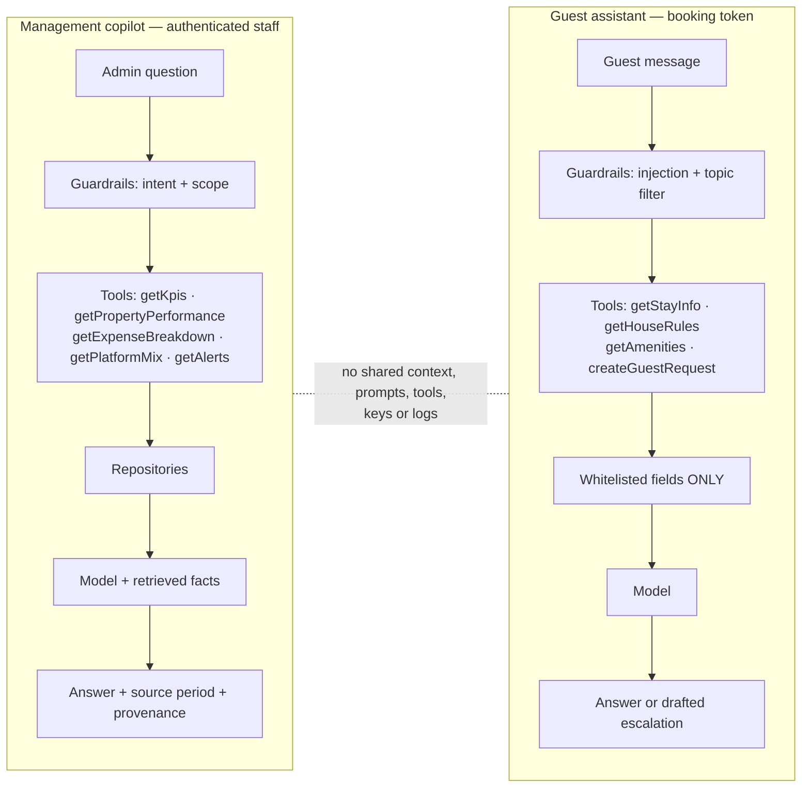

# HOMESTAY OPS — Web Platform Architecture Proposal (Phase 2)

**Status:** PROPOSAL — awaiting approval. No application code written yet.
**V1 relationship:** the Google Sheets workbook (`homestay-ops/`) remains the operational
source of truth and the data contract. This proposal **reads and writes it; it does not
replace, migrate or modify it.** V1 verified intact at time of writing (all gates green).

> **Read §13 first if you are short on time.** Three decisions there materially change the
> build, and one of them (D1) is forced by how the V1 workbook actually computes its KPIs.

---

## 0. The finding that shapes this entire design

The V1 workbook computes KPIs in two structurally different ways, and only one of them is
safe for a multi-user web app:

| Block in `99_CALC` | Address | Keyed by | Concurrent-safe to read? |
|---|---|---|---|
| **Monthly block** (30 metrics × 12 months) | `B3:N37` | `CFG_FY_START` — fixed for the year | ✅ **Yes** |
| KPI scalars | `Q3:Q24` | `$Q$3` ← `CFG_REPORT_MONTH` | ❌ No |
| Per-property block | `A41:R65` | `$Q$3` | ❌ No |
| Platform mix | `A71:E78` | `$Q$3` | ❌ No |
| Expense mix | `A83:B87` | `$Q$3` | ❌ No |

`CFG_REPORT_MONTH` is **one shared mutable cell** (`01_DASHBOARD!C3`). If the web app wrote
it to fetch "March for user A" while user B requested January, the two would corrupt each
other's reads — and would also silently change what the human operator sees on the
spreadsheet dashboard. Reading those blocks would also mean a **write on every page view**,
which is unacceptable for quota, latency, audit cleanliness and data integrity.

**Therefore (Decision D1): the web app never writes `CFG_REPORT_MONTH`.**
- Time-series and period KPIs → read the **monthly block** (safe, one batch call, all 12 months).
- Per-property / per-platform / per-category breakdowns → **computed server-side in TypeScript**
  from raw ledger rows, using direct ports of the V1 formula definitions.
- A **parity test** proves the server-side computations equal the workbook's own numbers.

This is not a workaround; it is the correct separation. Period selection is a *per-user
session concern* and must not live in shared spreadsheet state.

---

## 1. Architecture Proposal

### 1.1 Principles

1. **The workbook is the system of record.** No business data is duplicated into a database.
2. **The browser never touches Google or OpenAI.** All credentials are server-side only.
3. **The column contract is generated, never retyped.** (Decision D2, §5.2)
4. **Authorization is enforced at the API boundary**, then re-enforced at the data layer.
   UI hiding is cosmetic and is never the control.
5. **Derived numbers are computed once, in one place**, and parity-tested against V1.
6. **AI reads through the same repositories as the UI** — it gets no privileged path and no
   raw ledger dumps.

### 1.2 Layer model



**Hard rule enforced by build tooling:** every file under `lib/server/**` starts with
`import 'server-only'`. Any accidental client import fails the build rather than shipping a
credential path to the browser.

### 1.3 Why Supabase Postgres exists here (and what it must *not* hold)

Google Sheets cannot provide: user identity, role storage, atomic ID allocation, audit
trails, rate-limit counters, AI usage accounting, or a notification approval queue. Putting
those in Sheets would be slow, racy and would pollute the V1 contract.

| Supabase holds (✅) | Supabase must never hold (❌) |
|---|---|
| Users, roles, `investor_id` mapping | Reservations, revenue, expenses |
| Audit log (who changed what, when) | Property master, investor master |
| ID sequences (see §5.5) | Any KPI or financial figure as a source |
| AI conversation + token logs | Anything that would make it a second source of truth |
| Notification queue + approval state | — |
| Rate-limit + idempotency keys | — |
| Cache entries (short-TTL, disposable) | — |

If Supabase were wiped, **no business data would be lost** — only identity and history.
That is the test for whether something belongs there.

---

## 2. Repository Structure

Single repo, separate from V1. **`homestay-ops/` is never imported at runtime** — only read
once at build time by the contract generator.

```
SV/
├── homestay-ops/                    ← V1. DO NOT MODIFY. Read-only input to codegen.
└── homestay-web/
    ├── app/
    │   ├── (public)/login/
    │   ├── (admin)/admin/…          ← 20 routes, §6
    │   ├── (ops)/operations/…       ← 7 routes
    │   ├── (investor)/investor/…    ← 5 routes
    │   ├── (guest)/guest/…          ← 4 routes, token-scoped
    │   └── api/…                    ← route handlers, §7
    ├── lib/
    │   ├── server/                  ← 'server-only' — the credential boundary
    │   │   ├── sheets/
    │   │   │   ├── client.ts              GoogleSheetsClient
    │   │   │   ├── cache.ts               read-through cache
    │   │   │   ├── writer.ts              append/update, INPUT columns only
    │   │   │   └── repositories/          one file per repository (§5.3)
    │   │   ├── analytics/
    │   │   │   ├── kpi.ts                 ports of V1 formula definitions
    │   │   │   ├── forecast.ts            deterministic, no AI
    │   │   │   └── parity.ts              server-vs-workbook comparison
    │   │   ├── ai/
    │   │   │   ├── openai.ts              OpenAIService
    │   │   │   ├── context.ts             AIContextService
    │   │   │   ├── guardrails.ts          AIGuardrails
    │   │   │   ├── logger.ts              AIConversationLogger
    │   │   │   └── tools/                 typed retrieval tools
    │   │   ├── auth/                      session, RBAC, investor scoping
    │   │   ├── notifications/             NotificationService + adapters
    │   │   └── audit/
    │   ├── contract/
    │   │   ├── generate.mjs               parses homestay-ops/src/00_constants.gs
    │   │   ├── contract.generated.ts      ← DO NOT EDIT BY HAND
    │   │   └── contract.lock.json         drift detection for CI
    │   └── shared/                        types safe for client+server
    ├── components/                        ui/ · charts/ · tables/ · layout/
    ├── tests/
    │   ├── contract.test.ts               generated contract matches V1
    │   ├── rbac.test.ts                   every route × every role
    │   ├── parity.test.ts                 server KPIs == workbook KPIs
    │   └── ai-isolation.test.ts           guest context cannot reach internal data
    ├── docs/                              this file, runbooks, env reference
    ├── .env.example                       names only, never values
    └── netlify.toml
```

---

## 3. Data-Flow Diagrams

### 3.1 Read path (admin dashboard, cache miss)



**One `batchGet` per dashboard load, not one call per widget.** This is the difference
between ~400 ms and ~6 s, and between comfortable quota headroom and rate-limit failures.

### 3.2 Write path (create reservation)



Note step 8: Sheets recalculates asynchronously. The writer re-reads with a short backoff so
the UI shows the **workbook's** computed values, never a client-side guess.

---

## 4. Authentication & RBAC Design

### 4.1 Identity

- **Supabase Auth**, email + password with mandatory email confirmation. Magic links
  optional for OPERATIONS staff (fewer passwords on shared devices).
- **No self-signup.** Accounts are provisioned by SUPER_ADMIN. Public signup is disabled at
  the Supabase project level, not just hidden in the UI.
- Sessions via httpOnly, Secure, SameSite=Lax cookies. Refresh handled server-side.

### 4.2 Role model

```
app_users
  id            uuid  → auth.users.id
  role          enum('SUPER_ADMIN','ADMIN','OPERATIONS','INVESTOR')
  investor_id   text  null   -- REQUIRED when role = INVESTOR; maps to 11_INVESTORS.InvestorID
  status        enum('ACTIVE','SUSPENDED')
  created_at / created_by
```

**The role and `investor_id` are read server-side from this table on every request.** They
are never taken from the JWT payload, a header, a query string or the request body. An
investor cannot request another investor's data because the identifier is never an input.

### 4.3 Enforcement — three independent layers

| Layer | Mechanism | Blocks |
|---|---|---|
| 1. Middleware | route-prefix → allowed roles | direct URL navigation |
| 2. API guard | `withAuth([ROLES])` wraps every handler | direct API calls, curl, replay |
| 3. Data scoping | repositories take an `AuthContext`; investor queries are filtered by the **server-resolved** `investor_id` | IDOR / parameter tampering |

```ts
// shape only — illustrative
export const GET = withAuth(['ADMIN','SUPER_ADMIN'], async (req, ctx) => { … })
export const GET = withAuth(['INVESTOR'], async (req, ctx) =>
  investorRepo.getPortfolio(ctx.investorId))   // ctx.investorId, never req params
```

### 4.4 Permission matrix (abridged — full matrix is a test fixture)

| Capability | SUPER_ADMIN | ADMIN | OPERATIONS | INVESTOR |
|---|:--:|:--:|:--:|:--:|
| Dashboard (financial) | ✅ | ✅ | ❌ | ❌ |
| Reservations read / write | ✅ | ✅ | ✅ | ❌ |
| Guest name / contact | ✅ | ✅ | ✅ | ❌ |
| Revenue · Expenses · CAPEX · Rent · Cash flow · P&L | ✅ | ✅ | ❌ | ❌ |
| Housekeeping · Maintenance · Inventory | ✅ | ✅ | ✅ | ❌ |
| Investor master (all investors) | ✅ | ✅ | ❌ | ❌ |
| Own investment + approved KPIs | ✅ | ✅ | ❌ | ✅ |
| Settings / business rules | ✅ | ⚠️ read-only | ❌ | ❌ |
| User management | ✅ | ❌ | ❌ | ❌ |
| AI management copilot | ✅ | ✅ | ⚠️ ops-scoped | ❌ |
| Audit log | ✅ | ⚠️ read-only | ❌ | ❌ |

⚠️ **Business rules stay editable in the workbook only.** The web app displays them
read-only. Rationale: they are the commercial terms; a single edit path with the existing
red-block warnings and version history is safer than two.

### 4.5 Guest access (no accounts)

Guests never get Supabase accounts. `/guest/*` is opened by a **signed, booking-scoped,
expiring token** (JWT: `bookingId`, `propertyId`, `exp` = checkout + 24 h), delivered as a
link. The token grants access to that booking's stay info and the guest AI only. Revocable
by booking. This avoids storing guest credentials entirely and keeps guest PII minimal.

---

## 5. Google Sheets Integration Design

### 5.1 Credentials

Google Cloud **service account**, JSON key base64-encoded into a Netlify environment
variable. The workbook is shared with the service-account email as **Editor**. Scope:
`spreadsheets` only. Key never enters Git; `.env.example` carries names only. Rotation
procedure documented in the runbook.

### 5.2 The generated contract (Decision D2)

`lib/contract/generate.mjs` evaluates `homestay-ops/src/00_constants.gs` in a sandbox and
emits `contract.generated.ts`:

```ts
export const SHEETS = { RESERVATIONS: '04_RESERVATIONS', … } as const
export const RESERVATIONS_COLUMNS = [
  { key: 'BookingID',    header: 'Booking ID', a1: 'A', index: 1,  type: 'id',   role: 'in'   },
  { key: 'Nights',       header: 'Nights',     a1: 'P', index: 16, type: 'int',  role: 'calc' },
  …
] as const
export const LISTS = { BOOKING_STATUS: ['Inquiry','Confirmed', …] } as const
export const CALC_MAP = { monthly: { NetRevenue: 17, … }, firstMonthCol: 2, months: 12 }
export const DATA_ROW = 4
```

Consequences, all of them load-bearing:
- Column letters are **derived**, so inserting a column in V1 cannot silently misalign the web app.
- `role: 'calc'` makes calculated columns **unwritable by construction** — the writer filters them out.
- Enums (`BOOKING_STATUS`, `PAYMENT_STATUS`, …) become TypeScript unions **and** zod schemas.
- `contract.lock.json` is committed; **CI fails if V1's contract changes without review.**

This is how "do not invent alternative names" is guaranteed mechanically rather than by
discipline.

### 5.3 Interfaces

```ts
interface GoogleSheetsClient {
  batchGet(ranges: A1[]): Promise<Record<A1, Cell[][]>>
  getSheet(name: SheetName, opts?): Promise<Row[]>
  append(name: SheetName, rows: InputRow[]): Promise<AppendResult>
  updateCells(name: SheetName, edits: CellEdit[]): Promise<void>
  updateRowById(name: SheetName, idColumn, id, patch: InputPatch): Promise<Row>
}
```

Repositories (one concern each, all returning typed domain objects):

`PropertyRepository` · `ReservationRepository` · `RevenueRepository` ·
`ExpenseRepository` · `CapexRepository` · `RentRepository` · `CashFlowRepository` ·
`InvestorRepository` · `DistributionRepository` · `OperationsRepository`
(housekeeping + maintenance + inventory + compliance) · `AnalyticsRepository`
(99_CALC monthly block, alerts stack) · `SettingsRepository` (read-only)

**No route handler, component or AI tool ever calls the Sheets API directly.**

### 5.4 Read strategy & caching

| Data | Source | TTL |
|---|---|---|
| Monthly block (`99_CALC!B3:N37`) | direct | 120 s |
| Settings / properties / investors | direct | 300 s |
| Ledgers (04/05/06/07/08/09) | direct | 60 s |
| Ops sheets (13/14/15/17) | direct | 30 s |
| Alerts stack (`99_CALC!E121:G180`) | direct | 60 s |

Cache is keyed by range, stored in Supabase (shared across function instances), and
**invalidated immediately on any write to the affected sheet**. Every API response carries
`asOf` so the UI can display data freshness honestly rather than implying real-time.

### 5.5 Write strategy

1. **INPUT columns only.** Enforced by `role: 'calc'` in the generated contract.
2. **ID allocation is atomic** via a Supabase sequence table (`sheet`, `prefix`, `year`,
   `last_value`) inside a transaction — two concurrent bookings cannot both become
   `BK-2026-0042`. Format matches V1 exactly (`BK-`/`REV-`/`EXP-`/`CAP-`/`MNT-`/`HK-`/`CSH-`).
   The V1 `generateNextIds` menu item remains available for rows typed directly into the sheet.
3. **Idempotency keys** on all POSTs — a retried request cannot double-append.
4. **Serialized writes per sheet** via a short-lived advisory lock, so `append` never races.
5. **Read-after-write with backoff** so the client sees workbook-computed values.
6. **Audit entry per mutation**: actor, role, sheet, record id, before/after, timestamp, IP.

### 5.6 What the web app must never do to the workbook

- ❌ Write `CFG_REPORT_MONTH` or any `CFG_*` business rule
- ❌ Write any `role: 'calc'` column
- ❌ Insert/delete/rename sheets, columns or named ranges
- ❌ Run `setupWorkbook()` or any destructive V1 function
- ❌ Write to `99_CALC`, `10_MONTHLY_PNL`, `19_ANALYTICS`, `20_QA_CHECKS`

---

## 6. Route Map

All 36 requested routes, with the guard applied to each. `layout.tsx` per group applies the
role gate; the API guard is independent and authoritative.

| Group | Routes | Roles |
|---|---|---|
| Public | `/login` | — |
| Admin (20) | `/admin`, `/dashboard`, `/properties`, `/reservations`, `/revenue`, `/expenses`, `/capex`, `/rent`, `/cashflow`, `/pnl`, `/investors`, `/operations`, `/housekeeping`, `/maintenance`, `/inventory`, `/compliance`, `/analytics`, `/reports`, `/settings`, `/ai` | ADMIN, SUPER_ADMIN |
| Operations (7) | `/operations`, `/today`, `/checkins`, `/checkouts`, `/housekeeping`, `/maintenance`, `/guest-requests`, `/inventory` | OPERATIONS (+ADMIN) |
| Investor (5) | `/investor`, `/overview`, `/performance`, `/distributions`, `/reports` | INVESTOR (+ADMIN read) |
| Guest (4) | `/guest`, `/help`, `/stay-information`, `/request-help` | signed booking token |

`/admin/settings` renders V1 business rules **read-only**, with each rule labelled
**LIVE** or **RECORDED-ONLY** exactly as the workbook does, and a deep link to the sheet.

---

## 7. API Contracts

Conventions: JSON; `?month=YYYY-MM`, `?from=&to=`, `?propertyId=`; every response
`{ data, meta: { asOf, source, period } }`; errors `{ error: { code, message, fields? } }`;
all mutations require `Idempotency-Key`.

### Analytics & dashboards
| Method | Path | Roles | Notes |
|---|---|---|---|
| GET | `/api/analytics/dashboard` | ADMIN | KPI set + property performance + ops counters |
| GET | `/api/analytics/timeseries` | ADMIN | 12-month block: revenue, expenses, profit, occupancy, ADR, RevPAR |
| GET | `/api/analytics/by-property` | ADMIN | server-computed, period-scoped |
| GET | `/api/analytics/by-platform` | ADMIN | OTA mix |
| GET | `/api/analytics/alerts` | ADMIN, OPS | from the V1 alerts stack, filtered by role |
| GET | `/api/analytics/parity` | SUPER_ADMIN | server vs workbook reconciliation report |

### Operational data
| Method | Path | Roles |
|---|---|---|
| GET/POST | `/api/reservations` · GET/PATCH `/api/reservations/:id` | ADMIN, OPS |
| GET | `/api/operations/today` | OPS, ADMIN |
| POST | `/api/operations/checkin/:bookingId` · `/checkout/:bookingId` | OPS, ADMIN |
| GET/POST/PATCH | `/api/housekeeping[/:id]` | OPS, ADMIN |
| GET/POST/PATCH | `/api/maintenance[/:id]` | OPS, ADMIN |
| GET/PATCH | `/api/inventory[/:id]` | OPS, ADMIN |
| GET/POST/PATCH | `/api/guest-requests[/:id]` | OPS, ADMIN |
| GET/POST | `/api/revenue` · `/api/expenses` · `/api/capex` · `/api/cashflow` | ADMIN |
| GET | `/api/pnl` · `/api/rent` · `/api/compliance` | ADMIN |

### Investor (server-scoped — no investor identifier is ever accepted as input)
| Method | Path | Returns |
|---|---|---|
| GET | `/api/investor/overview` | own capital, participation %, approved KPIs |
| GET | `/api/investor/performance` | approved revenue/profit/occupancy trends |
| GET | `/api/investor/distributions` | own calculated / paid / pending only |
| GET | `/api/investor/reports` | list + signed download of **approved** reports |

### AI, forecasting, notifications
| Method | Path | Roles |
|---|---|---|
| POST | `/api/ai/copilot` | ADMIN (OPS: ops-scoped) |
| POST | `/api/ai/guest` | booking token |
| POST | `/api/ai/reviews/import` · `/analyze` | ADMIN |
| GET | `/api/ai/usage` | ADMIN — tokens, cost, per-feature |
| GET | `/api/forecast/{occupancy,revenue,cashflow}` | ADMIN |
| GET/POST | `/api/notifications` · `/:id/approve` · `/:id/reject` | ADMIN, OPS |
| GET | `/api/audit` | SUPER_ADMIN |

---

## 8. AI Context & Security Design

### 8.1 Two hard-isolated contexts



The guest assistant is a **separate service with its own system prompt, its own tool
registry and its own repository facade**. It is not the admin copilot with a smaller prompt
— a prompt cannot be a security boundary. `tests/ai-isolation.test.ts` asserts that every
guest tool returns only whitelisted fields, and that no financial repository is reachable
from the guest tool registry.

### 8.2 Anti-fabrication rules (AIGuardrails)

1. **Numbers may only come from tool results.** The model is instructed never to compute or
   estimate; a post-response validator extracts numeric tokens and flags any figure not
   present in the tool payload for that turn.
2. **Every financial answer states its source period and sheet.**
   *"MTD net revenue for Mar-2026 is ₹1,84,300 (source: 05_REVENUE via 99_CALC, as of 14:32)."*
3. **No data → say so.** "Insufficient data" is a valid, required answer.
4. **Forecasts are never generated by the model.** The AI may *explain* a forecast produced
   by the deterministic service (§9); it may not produce one.
5. **Untrusted text is fenced.** Imported reviews and guest messages are delimited and
   prefixed as data-not-instructions; tool-calling is restricted for those turns.

### 8.3 Data minimisation

| Context | Sees | Never sees |
|---|---|---|
| Copilot | aggregates, per-property/per-platform metrics, alert summaries | raw ledgers, guest contact details, other tenants' data |
| Guest | own booking's stay info, property amenities, house rules, approved FAQ | revenue, profit, rent, investors, suppliers, internal notes, other guests |
| Review analysis | review text + property id | any financial or guest-identifying field |

Guest names are stripped from copilot context by default — the copilot is a management tool
and does not need them.

### 8.4 Cost control

- **Model tiering:** cheapest capable model for classification/extraction/summaries; a
  mid-tier reasoning model only for the copilot's analytical questions. No flagship model
  for routine work. Model IDs live in config, changeable without a deploy.
- **Per-feature kill switches** (copilot / guest / reviews / summaries) in admin settings.
- **Hard monthly budget cap** with soft warning at 70%: on breach, AI features degrade to
  disabled with a clear message — never a silent overspend.
- **Rate limits** per user and per role; stricter for the guest endpoint.
- **Response caching** for deterministic, non-personalised prompts (FAQ answers, category
  classification) keyed by content hash.
- **Context caps**: max input tokens per feature, enforced before the call.
- **Every call logged**: feature, model, prompt/completion tokens, computed cost, latency,
  user, outcome → `/admin/ai` usage dashboard.

---

## 9. Forecasting (deterministic — no AI)

Separate `ForecastService`. Methods, in order of preference as history accumulates:

| Horizon | Method | Minimum history |
|---|---|---|
| Occupancy | booking-on-hand (confirmed future nights) + rolling 3-month average of the residual pickup | 2 complete months |
| Revenue | forecast occupied nights × trailing ADR (property-level) | 2 complete months |
| Cash flow | opening balance + expected payouts (with per-platform lag from Settings) − scheduled rent/fixed costs − trailing variable-cost average | 2 complete months |
| Seasonality | month-of-year index | **12+ months** — otherwise not applied |

Rules:
- Below the threshold → render **`INSUFFICIENT DATA`**, never a number.
- Every forecast is labelled **ESTIMATE** with its method, inputs and month count.
- Confidence: HIGH / MEDIUM / LOW derived from history length, variance and booking-on-hand
  coverage — a stated rule, not a vibe.
- **Forecast vs actual** is retained each month so accuracy becomes visible over time.
- Booking-on-hand is a genuine strength here: near-term occupancy is substantially *known*,
  not predicted, because future confirmed reservations already exist in `04_RESERVATIONS`.

---

## 10. Deployment Architecture & Cost

### 10.1 Topology

```
GitHub (private)
  └─ push to main → Netlify build (Next.js runtime)
       ├─ prebuild: contract codegen + drift check + typecheck + tests
       ├─ Static/RSC assets → Netlify CDN
       ├─ Route handlers   → Netlify Functions
       └─ Scheduled Functions → daily 07:00 IST summary, hourly alert sweep
Supabase (free)  → auth, roles, audit, sequences, AI logs, cache
Google Sheets    → V1 workbook (service account)
OpenAI           → usage-priced
```

Environments: **Preview** (branch deploys, points at a *copy* of the workbook) and
**Production**. Preview must never write to the production workbook — enforced by a separate
`GOOGLE_SHEET_ID` per environment.

### 10.2 Cost estimate

| Component | Plan | Expected cost |
|---|---|---|
| Netlify | Free (Starter) | **$0** |
| Supabase | Free | **$0** |
| Google Sheets API | Free quota | **$0** |
| Domain | none yet — platform URL | **$0** |
| Email | provider free tier (~100/day) | **$0** |
| **Infrastructure subtotal** | | **$0 / month** |
| OpenAI | usage-priced | **see below** |

**OpenAI — the only real cost.** Illustrative for a 4-unit operation:

| Feature | Volume/month | Model tier | Est. cost |
|---|---|---|---|
| Management copilot | ~200 questions | mid | $2–6 |
| Guest assistant | ~300 messages | small | $1–3 |
| Daily ops summary | 30 runs | small | <$1 |
| Review analysis | ~50 reviews | small | <$1 |
| **Total** | | | **≈ $5–12 / month** |

Assumptions to confirm at build time: current per-token pricing, and average context sizes
after the caps in §8.4. **Recommend a hard cap of $25/month** initially — roughly 2× the
estimate, so a bug cannot become a bill.

### 10.3 Free-tier constraints to design within

| Limit | Consequence | Mitigation |
|---|---|---|
| Netlify function timeout (~10 s sync) | a slow multi-range Sheets read could time out | single `batchGet`, caching, streaming UI |
| Netlify free function invocations/runtime | high polling would exhaust it | no polling; explicit refresh + cache |
| Supabase free projects pause when idle | login could fail after a quiet week | daily scheduled ping (the cron already runs) |
| Sheets API 60 reads/min/user, 300/min/project | concurrent users could hit it | shared cache + batching + backoff |
| Cold starts | first request slower | RSC shell renders immediately, data streams in |

> Free-tier terms change and vary by commercial use. **Verify current Netlify and Supabase
> terms permit this commercial deployment before launch** — flagged as a management item (§13).

---

## 11. Implementation Sequence

I recommend the requested phase order with **two changes**, both of which reduce risk:

| # | Phase | Deliverable | Why here |
|---|---|---|---|
| 1 | Foundation | Repo, CI, **contract codegen**, typecheck, `server-only` boundary | Everything depends on the contract; generate it first |
| 2 | **Sheets adapter + parity harness** ⬅️ *moved earlier* | Client, repositories, cache, parity test vs workbook | **The single largest technical risk. Prove it before building UI on top of it.** |
| 3 | Auth + RBAC | Supabase, roles, three-layer guard, RBAC test matrix | Security precedes features, never retrofitted |
| 4 | Admin dashboard | KPIs, property performance, ops counters, charts | First real value; validates the read path |
| 5 | Admin data screens | Reservations (incl. **write path**, IDs, audit), revenue, expenses, CAPEX, rent, cash flow, P&L | Write path proven on the busiest entity first |
| 6 | Operations portal | TODAY screen, check-in/out, housekeeping, maintenance, inventory, guest requests | Daily-use surface |
| 7 | Investor portal | Scoped overview, performance, distributions, approved reports | Needs approval rules from §13 first |
| 8 | Analytics + forecasting | Deterministic service, sufficiency gating, forecast-vs-actual | Requires ≥2 months of real data to be meaningful |
| 9 | AI copilot | Tools, guardrails, logging, usage dashboard, budget cap | Must sit on proven data; otherwise it lies confidently |
| 10 | Guest assistant + portal | Token links, guest-safe context, request→ticket flow | Externally visible — hardened last |
| 11 | Notifications + automation | NotificationService, email + in-app, **draft→approve→send** queue, scheduled jobs | Depends on 6, 9, 10 |
| 12 | Security & QA hardening | Pen-test pass, rate limits, headers, audit review, load check | Gate to production |
| 13 | Deployment & handover | Prod env, runbook, env documentation, rollback drill | — |

Phase 2 ends with a **go/no-go**: if server-computed KPIs do not reconcile to the workbook,
the design is corrected before any UI is built.

---

## 12. Risks

| # | Risk | Impact | Likelihood | Mitigation |
|---|---|---|---|---|
| R1 | **Shared `CFG_REPORT_MONTH` state** | Corrupted reads, operator confusion | High if ignored | **D1** — never write it; compute server-side (§0) |
| R2 | Server KPIs drift from workbook KPIs | Two truths; loss of trust | Medium | Parity test in CI + `/api/analytics/parity` + phase-2 gate |
| R3 | Sheets as a database: no transactions, weak concurrency | Duplicate/lost rows | Medium | Atomic IDs, idempotency keys, per-sheet write lock, audit |
| R4 | Sheets API latency/quota | Slow or failing dashboards | Medium | `batchGet`, caching, backoff, no polling |
| R5 | Recalculation lag after write | Stale computed values shown | Medium | Read-after-write with backoff |
| R6 | Someone edits the workbook structure | Web app breaks | Medium | `contract.lock.json` drift check fails CI; V1 protections warn |
| R7 | Single spreadsheet = single point of failure | Total outage | Low | Scheduled export snapshot to Drive; documented restore; Sheets version history |
| R8 | AI fabricates a business number | Bad decisions | Medium | Tool-only numbers + numeric validator + provenance (§8.2) |
| R9 | Prompt injection via reviews/guest text | Data leakage attempt | Medium | Fenced untrusted input, restricted tools, isolated guest context |
| R10 | Guest PII exposure | Legal + trust | Low | Minimal collection, token scoping, no guest PII in AI/charts |
| R11 | **India DPDP Act 2023 obligations** | Compliance | Medium | Legal review; retention policy; consent language — **management decision** |
| R12 | Free-tier ToS for commercial use / limits change | Forced migration | Medium | Verify terms; keep app portable (Vercel/Cloudflare are drop-in) |
| R13 | OpenAI cost overrun | Unbudgeted spend | Low | Hard cap, per-feature switches, cheapest capable model, logging |
| R14 | Netlify 10 s function limit | Timeouts on heavy pages | Low–Med | Single batch read + cache; move heavy jobs to scheduled functions |
| R15 | Operator confusion: two front doors (sheet + web) | Conflicting edits | Medium | Define the canonical entry path per workflow — **management decision** |
| R16 | Supabase idle pause on free tier | Login failure after quiet period | Low | Daily scheduled ping |

---

## 13. Decisions Required Before Build

### Architectural decisions I recommend and need confirmed

- **D1 — Never write `CFG_REPORT_MONTH`; compute period/property/platform breakdowns
  server-side, parity-tested against the workbook.** *(Strongly recommended; §0 explains why
  the alternative is unsafe.)*
- **D2 — Generate the TypeScript contract from `00_constants.gs`; CI fails on drift.**
- **D3 — Supabase Postgres for identity/audit/sequences/AI logs only — never business data.**

### Questions only management can answer

| # | Question | Blocks |
|---|---|---|
| 1 | **Which figures may an investor see?** Portfolio totals only, or per-property? Their own distribution only, or the total pool? | Phase 7 |
| 2 | **Do investors see figures before month-end close?** Recommend: only months marked `CLOSED ✓` in `18_MONTHLY_CLOSE`. | Phase 7 |
| 3 | **Who approves outbound guest messages**, and what is the SLA? | Phase 11 |
| 4 | **Canonical entry path per workflow** — is the web app the only place staff enter bookings, or does direct sheet entry continue? | Phase 5 |
| 5 | **May ADMIN edit business rules from the web app**, or workbook-only (my recommendation)? | Phase 5 |
| 6 | **Monthly OpenAI budget cap?** (Recommend $25 to start.) | Phase 9 |
| 7 | **Guest data retention period**, and DPDP Act compliance owner? | Phase 10 |
| 8 | **Who owns the Google account** holding the workbook, and who holds break-glass access? | Phase 2 |
| 9 | **Named accounts and roles** for initial users? | Phase 3 |
| 10 | **Is a workbook copy available for Preview/staging?** (Strongly recommended.) | Phase 1 |
| 11 | **Confirm free-tier commercial use** is acceptable under current Netlify/Supabase terms. | Phase 13 |
| 12 | **Backup policy** — frequency and retention of workbook snapshots? | Phase 12 |
| 13 | **Guest portal delivery** — how does the link reach the guest (manual, email, OTA message)? | Phase 10 |
| 14 | **Which reports are "approved"** for investor download, and who approves them? | Phase 7 |
| 15 | **Do the V1 open items** (investor pool %, operator %, reserve, loss treatment, tax, commissions) get resolved before or during this build? Investor-facing figures remain ₹0 until they are. | Phase 7 |

---

## Awaiting approval

No application code will be written until this proposal is approved. On approval I would
start with **Phase 1 + Phase 2 (contract codegen and the Sheets adapter with the parity
harness)**, because that is where the risk concentrates — and deliver the parity report as
the first checkpoint before any UI work begins.

**V1 remains untouched.** Nothing in this proposal modifies `homestay-ops/`; the workbook is
read through a service account and written only in `role: 'in'` columns of transactional
sheets.
